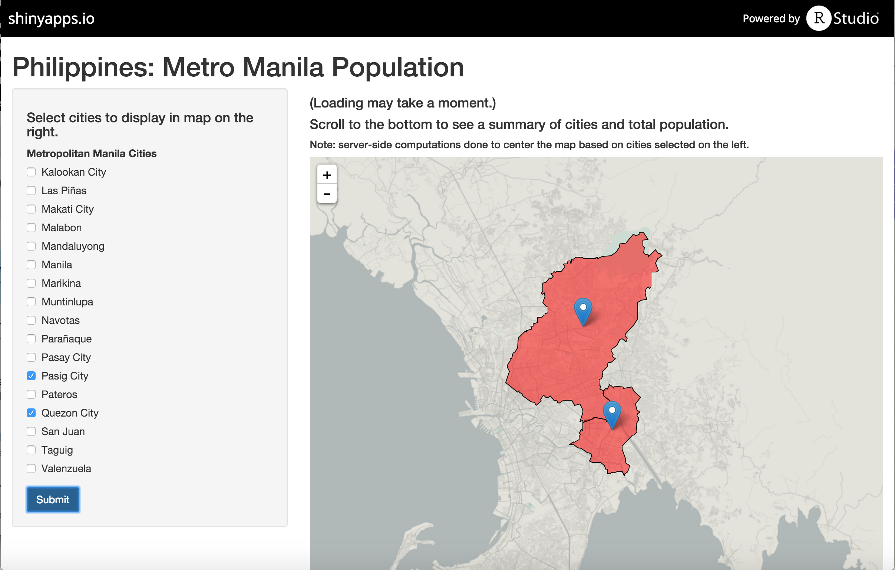

Metro Manila Population (Coursera Data Product Project Assignment)
========================================================
author: 
date:
transition: rotate

Metro Manila Cities and Population
========================================================


Population Table
========================================================


```
   ID          City   Total
1   1 Kalookan City 1489040
2   2     Las Piñas  552573
3   3   Makati City  529039
4   4       Malabon  353337
5   5   Mandaluyong  328699
6   6        Manila 1652171
7   7      Marikina  424150
8   8    Muntinlupa  459941
9   9       Navotas  249131
10 10     Parañaque  588126
11 11    Pasay City  392869
12 12    Pasig City  669773
13 13       Pateros   64147
14 14   Quezon City 2761720
15 15      San Juan  121430
16 16        Taguig  644473
17 17    Valenzuela  575356
```

Metro Manila (Philippines) Population, as of 2010
========================================================

_Select cities on the left to render on the map_




Shiny App Highlights
========================================================
incremental: true

- Uses the R Leaflet Library
- Computes center of map image based on the selected city polygon coordinates
- Uses reactive functions to minimize server resources

Final
========================================================

# Thank you!
